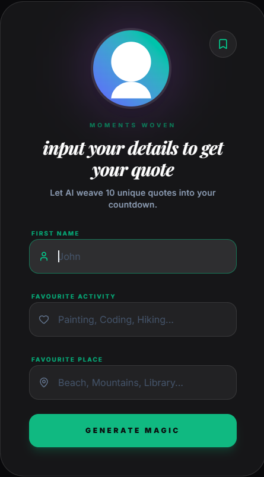
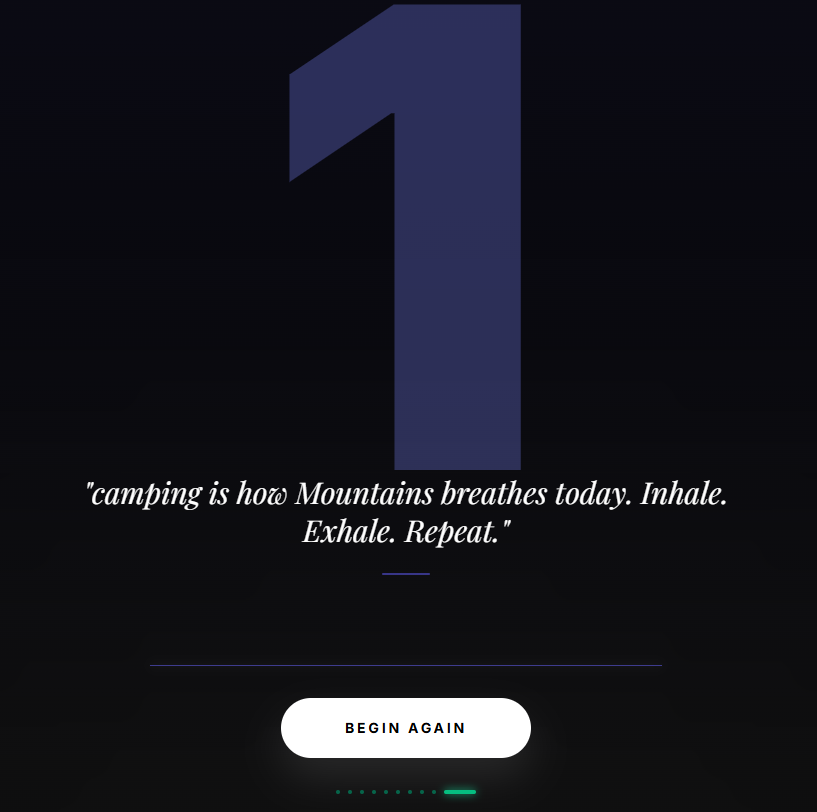

# Moments Woven: AI Personality Countdown 🎯

[](https://react.dev/)
[](https://tailwindcss.com/)
[](https://ai.google.dev/)
[](https://opensource.org/licenses/Apache-2.0)

**Moments Woven** is an interactive countdown event driven by artificial intelligence to connect the dots between user information and personal inspiration. Our artificial intelligence platform integrates your name, favorite things, and beloved places to present a series of ten distinct insights that unfold in a countdown movie format.

---

## 🚀 Key Features

-   **Intelligent Synthesis**: Leveraging Google Gemini AI to generate contextually relevant quotes based on personalized user input.
-   **Cinematic Countdown**: A fluid 10-to-1 transition experience featuring high-impact typography and ambient background visuals.
-   **Thematic UI States**: Dynamic UI skinning that adapts based on the "mood" of the generated content (Funny, Deep, Short, Motivational).
-   **Archive of Reflections**: A persistence layer allowing users to "bookmark" their favorite AI-generated moments for later viewing.
-   **Hardware-Accelerated Motion**: Silky-smooth transitions and stagger effects built with Framer Motion.

## 🖼️ Visual Experience

| Authentication & Input | Countdown Reveal | Archive View |
| :--- | :--- | :--- |
|  |  |  |

> *Note: Visuals are tailored to high-density displays with dark-mode optimization.*

## 🛠️ Technical Architecture

This project is built on a modern full-stack foundation, prioritizing performance, type safety, and aesthetic precision.

### Frontend
-   **React 19**: Utilizing the latest concurrent rendering features and `AnimatePresence` for state-driven transitions.
-   **TypeScript**: Strict type definitions for application state, API responses, and theme configurations.
-   **Motion (Framer Motion)**: Orchestrating layout-level transitions and complex keyframe animations.
-   **Tailwind CSS 4**: A utility-first approach with custom theme extensions for "glassmorphism" and radial gradients.

### Backend & AI
-   **Google Gemini SDK**: Real-time prompt engineering to transform user inputs into structured JSON quote sequences.
-   **Express / Node.js**: A slim proxy layer used to manage API credentials securely and serve as a development entry point.
-   **Vite**: Next-generation frontend tooling for rapid HMR (Hot Module Replacement) and optimized production bundles.

---

## 📌 How It Works

1.  **Data Ingestion**: The user provides a Name, Activity, and Place via a glass-morphic interface.
2.  **Prompt Engineering**: Our `geminiService` constructs a context-aware prompt requesting 10 specific quote types (e.g., "A motivating quote about [Activity] in [Place] for [Name]").
3.  **Generative Loop**: The Gemini 1.5 model returns a validated JSON array containing the text, type, and stylistic metadata.
4.  **Countdown Orchestration**: The UI enters a focused "Countdown" mode where each state transition is gated by user interaction, revealing one quote per digit.

---

## ⚙️ Installation & Development

To run this project locally:

1.  **Clone the repository**:
    ```bash
    git clone https://github.com/rocky0012-lang/moments-woven.git
    cd moments-woven
    ```

2.  **Install dependencies**:
    ```bash
    npm install
    ```

3.  **Environment Setup**:
    Create a `.env` file and add your Google Gemini API Key:
    ```env
    GEMINI_API_KEY=your_key_here
    ```

4.  **Start Development Server**:
    ```bash
    npm run dev
    ```

5.  **Build for Production**:
    ```bash
    npm run build
    ```

---
## 🤖 Android Studio

**App in AI Studio**: [aistudio](https://ai.studio/apps/034345d6-02ea-4505-8d9d-a5a43c2bf357)


## 🙌 Author

**Francis Gathua**
*Lead Developer & Product Visionary*

-   [GitHub](https://github.com/rocky0012-lang)

---

## 📜 License

Distributed under the Apache 2.0 License. See `LICENSE` for more information.
